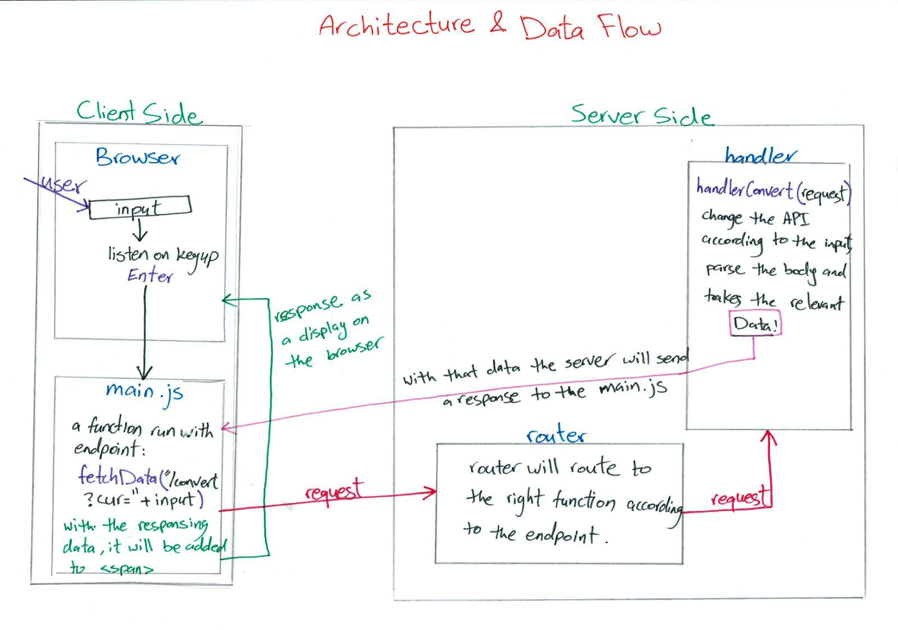
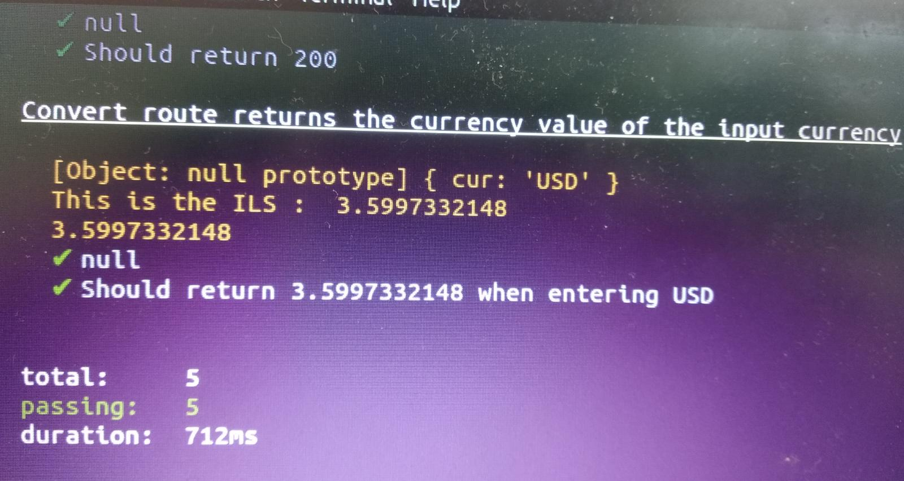
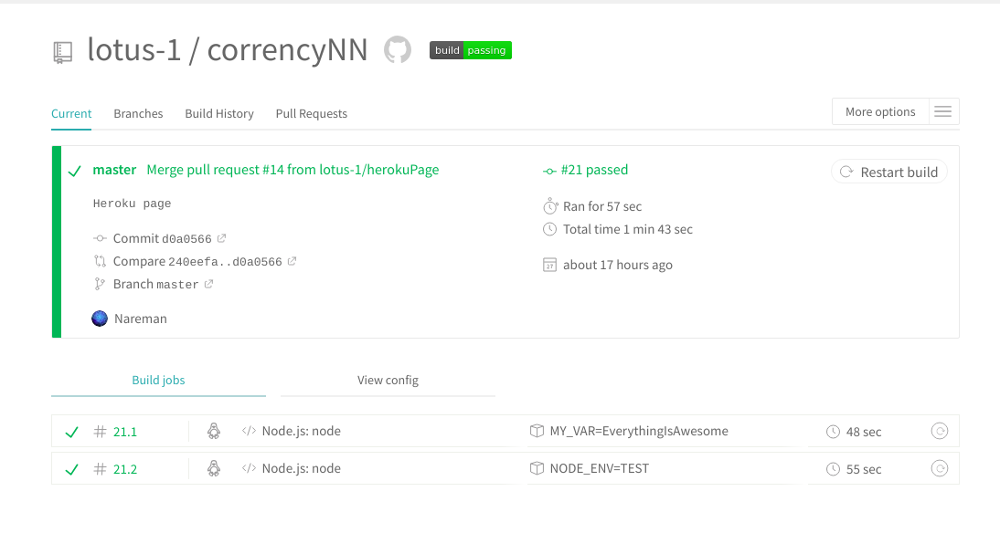

## corrency NN ##
*Team Mates :*
 - @NaremanPro  
 - @Noorb7188  

[our Page on Heroku](https://currencynn.herokuapp.com/)  :sunglasses:

**Welcome to our App : An Updated App that converts to you currencies to ILS**

  

start by our Architecture :
--------------------------

*Action Items :*
------------------  
1- We built our folders by putting all files related to client side in `public` and the files realted to server side in `server`. :file_folder:  

2- We chose our api for a curency converter : `https://api.exchangeratesapi.io/latest?base={the Currency} `  :dollar:  

3- We wrote our `index.html` code to work on our `input` so we can take the *value* and use it in our `api` as the "currency".  :money_with_wings:

4- We wrote our `server`, `handlers` and `router` code using `fs`, `path`, `require`, `url` and `querystring` modules. :bookmark_tabs:  

5- We wrote the `main.js` code using the `.addEventListener` for our input to take the value of the input and fetch it to our server with the url that includes this value, so we can take back the data we need which is the converted currency. :inbox_tray:    

6- Then in the `server` we wrote our `handler` function that will manipulate the data in the endpoint that the fetch sent. :pager:  

7- We write our test and supertests in `test` folder
   

8- We also linked our repo to Travis so my code will be checked by Travis too.  

 *Interesting Things*
 -------------------------
  We have encountered some interesting things while doing the project, most important was the feeling of how our "minds bounced between each other" (Mynah's quote :wink: ), also the "high" of connecting the missing pieces like when we understood how to connect between the fetch and the server using the input value :squirrel: :sweat_smile:   

  - If we had more time we would finish our last unfinished (Auto-complete) app :grin:
